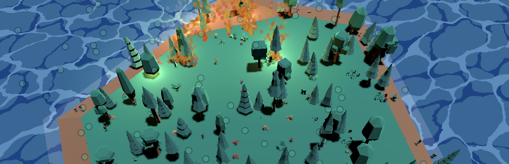

# Ecotomata
A small game based on the forest-fire cellular-automaton [as visualized Nicky Case](https://ncase.me/sim/)! Assets are mostly stolen from [kenney.nl](https://kenney.nl/). Nicky's and Kenney's stuff is [CC0](https://creativecommons.org/publicdomain/zero/1.0/deed.en), and so is this project 🧡

This is a birthday gift for a friend.

## Building
Made using [Godot](https://godotengine.org/) v4.3, which hopefully means you can simply clone this repo and open it in Godot.